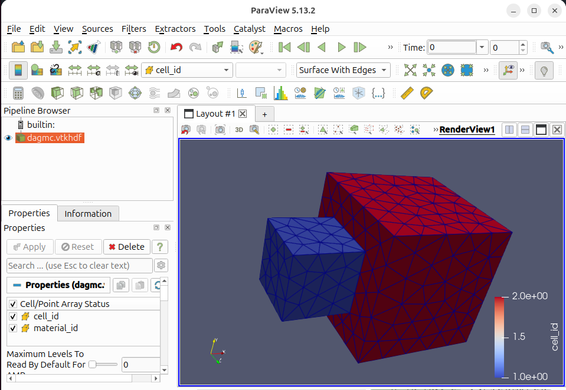

[](https://www.python.org)

[](https://github.com/fusion-energy/dagmc_h5m_file_inspector/actions/workflows/ci_with_install.yml)

[](https://codecov.io/gh/fusion-energy/dagmc_h5m_file_inspector)

[](https://github.com/fusion-energy/dagmc_h5m_file_inspector/actions/workflows/python-publish.yml)
[](https://pypi.org/project/dagmc_h5m_file_inspector/)

# dagmc-h5m-file-inspector

A minimal Python package that inspects DAGMC h5m files to extract volume IDs,
surface IDs, material tags, bounding boxes, geometric volumes, and surface areas.


# Installation

```bash
pip install dagmc-h5m-file-inspector
```

The package uses h5py as the default backend. Optionally, pymoab can be used
as an alternative backend if installed.


# Python API Usage

## Finding volume IDs

```python
import dagmc_h5m_file_inspector as di

di.get_volumes("dagmc.h5m")

>>> [1, 2]
```

## Finding material tags

```python
import dagmc_h5m_file_inspector as di

di.get_materials("dagmc.h5m")

>>> ['big_box', 'small_box']
```

## Finding volume IDs with their materials

```python
import dagmc_h5m_file_inspector as di

di.get_volumes_and_materials("dagmc.h5m")

>>> {1: 'small_box', 2: 'big_box'}
```

## Finding surface IDs

```python
import dagmc_h5m_file_inspector as di

di.get_surface_ids("dagmc.h5m")

>>> [1, 2, 3, 4, 5, 6, 7, 8, 9, 10, 11, 12]
```

## Finding surface IDs by cell ID

```python
import dagmc_h5m_file_inspector as di

di.get_surface_ids_by_cell_id("dagmc.h5m", cell_id=1)

>>> [1, 2, 3, 4, 5, 6]
```

## Finding surface IDs by material name

```python
import dagmc_h5m_file_inspector as di

di.get_surface_ids_by_material_name("dagmc.h5m", material="small_box")

>>> [1, 2, 3, 4, 5, 6]
```

## Getting the bounding box

Returns a `BoundingBox` object that is API compatible with OpenMC's `openmc.BoundingBox`.

```python
import dagmc_h5m_file_inspector as di

bbox = di.get_bounding_box("dagmc.h5m")

>>> bbox
BoundingBox((-5.0, -10.0, -10.0), (25.0, 10.0, 10.0))

>>> bbox.lower_left
(-5.0, -10.0, -10.0)

>>> bbox.upper_right
(25.0, 10.0, 10.0)

>>> bbox.center
(10.0, 0.0, 0.0)

>>> bbox.volume
18000.0

>>> bbox.width
(30.0, 20.0, 20.0)

>>> bbox.extent
{'xy': (-5.0, 25.0, -10.0, 10.0), 'xz': (-5.0, 25.0, -10.0, 10.0), 'yz': (-10.0, 10.0, -10.0, 10.0)}
```

The `BoundingBox` supports indexing, unpacking, containment checks, and set operations:

```python
# Unpacking
lower_left, upper_right = bbox

# Indexing
>>> bbox[0]
(-5.0, -10.0, -10.0)

# Point containment
>>> (0.0, 0.0, 0.0) in bbox
True

# Intersection and union of two bounding boxes
bbox_intersection = bbox1 & bbox2
bbox_union = bbox1 | bbox2
```

Optionally filter by material tag to get the bounding box for specific materials:

```python
import dagmc_h5m_file_inspector as di

# Bounding box for a single material
bbox = di.get_bounding_box("dagmc.h5m", materials="small_box")

>>> bbox.lower_left
(-5.0, -5.0, -5.0)

>>> bbox.upper_right
(5.0, 5.0, 5.0)

# Bounding box for multiple materials (combined)
bbox = di.get_bounding_box("dagmc.h5m", materials=["small_box", "big_box"])

>>> bbox.lower_left
(-5.0, -10.0, -10.0)

>>> bbox.upper_right
(25.0, 10.0, 10.0)
```

## Getting geometric volume sizes by cell ID

```python
import dagmc_h5m_file_inspector as di

di.get_volumes_by_cell_id("dagmc.h5m")

>>> {1: 1000.0, 2: 8000.0}
```

## Getting geometric volume sizes by material name

```python
import dagmc_h5m_file_inspector as di

di.get_volumes_by_material_name("dagmc.h5m")

>>> {'small_box': 1000.0, 'big_box': 8000.0}
```

## Getting geometric volume sizes by cell ID and material name

```python
import dagmc_h5m_file_inspector as di

di.get_volumes_by_cell_id_and_material_name("dagmc.h5m")

>>> {(1, 'small_box'): 1000.0, (2, 'big_box'): 8000.0}
```

## Getting surface areas by cell ID

Returns a list of surface areas, one per DAGMC surface bounding the volume.

```python
import dagmc_h5m_file_inspector as di

di.get_surface_area_by_cell_id("dagmc.h5m", cell_id=1)

>>> [100.0, 100.0, 100.0, 100.0, 100.0, 100.0]
```

## Getting surface areas by material name

Returns a list of surface areas for all DAGMC surfaces bounding volumes
with the given material.

```python
import dagmc_h5m_file_inspector as di

di.get_surface_area_by_material_name("dagmc.h5m", material="small_box")

>>> [100.0, 100.0, 100.0, 100.0, 100.0, 100.0]
```

## Getting surface areas by surface ID

Returns a dictionary mapping each surface ID to its area. Useful for
computing wall loading when combined with surface current tallies.

```python
import dagmc_h5m_file_inspector as di

di.get_surface_area_by_surface_id("dagmc.h5m")

>>> {1: 100.0, 2: 100.0, 3: 100.0, 4: 100.0, 5: 100.0, 6: 100.0,
     7: 100.0, 8: 400.0, 9: 400.0, 10: 400.0, 11: 400.0, 12: 400.0}
```

## Getting surface shared status

Returns a dictionary mapping each surface ID to the cell IDs and materials
that share it. Useful for identifying interfaces between volumes.

```python
import dagmc_h5m_file_inspector as di

di.get_surface_shared_status("dagmc.h5m")

>>> {1: {'materials': ['small_box'], 'cell_ids': [1]},
     2: {'materials': ['small_box'], 'cell_ids': [1]},
     ...
     7: {'materials': ['small_box', 'big_box'], 'cell_ids': [1, 2]},
     ...}
```

## Setting OpenMC material volumes from DAGMC geometry

This function reads the DAGMC file, matches materials by name, and sets the
`volume` attribute on the corresponding OpenMC Material objects.

```python
import openmc
import dagmc_h5m_file_inspector as di

# Create OpenMC materials with names matching the DAGMC file
small_box = openmc.Material(name='small_box')
big_box = openmc.Material(name='big_box')
materials = openmc.Materials([small_box, big_box])

# Set volumes from DAGMC geometry
di.set_openmc_material_volumes(materials, "dagmc.h5m")

>>> small_box.volume
1000.0

>>> big_box.volume
8000.0
```

## Getting triangle connectivity and coordinates for each volume

This function extracts the triangle mesh data for each volume, returning the
connectivity (vertex indices) and coordinates (3D points) needed for visualization
or mesh processing.

```python
import dagmc_h5m_file_inspector as di

data = di.get_triangle_conn_and_coords_by_volume("dagmc.h5m")

>>> data
{1: (array([[0, 1, 2], [0, 2, 3], ...]), array([[0., 0., 0.], [10., 0., 0.], ...])),
 2: (array([[0, 1, 2], [0, 2, 3], ...]), array([[-5., -10., -10.], [25., -10., -10.], ...]))}

# Access data for a specific volume
connectivity, coordinates = data[1]
>>> connectivity.shape
(12, 3)  # 12 triangles, each with 3 vertex indices
>>> coordinates.shape
(8, 3)   # 8 unique vertices, each with x, y, z coordinates
```

## Convert h5m file to vtkhdf

Convert DAGMC h5m files to vtkhdf which can be directly opened in Paraview 5.13+.

The resulting Paraview files have color for cell IDs and material tags present within the h5m file.

```python
import dagmc_h5m_file_inspector as di
di.convert_h5m_to_vtkhdf(h5m_filename='dagmc.h5m', vtkhdf_filename= 'dagmc.vtkhdf')
```




## Removing materials from h5m files

Remove one or more materials (and their associated volumes) from a DAGMC h5m file,
writing the result to a new file.

```python
import dagmc_h5m_file_inspector as di

di.get_materials("dagmc.h5m")

>>> ['big_box', 'small_box']

# Remove a single material
di.remove_materials(
    input_filename="dagmc.h5m",
    output_filename="dagmc_reduced.h5m",
    materials_to_remove="small_box",
)

di.get_materials("dagmc_reduced.h5m")

>>> ['big_box']
```

```python
import dagmc_h5m_file_inspector as di

di.get_materials("reactor.h5m")

>>> ['blanket', 'first_wall', 'shield']

# Remove multiple materials
di.remove_materials(
    input_filename="reactor.h5m",
    output_filename="reactor_reduced.h5m",
    materials_to_remove=["blanket", "shield"],
)

di.get_materials("reactor_reduced.h5m")

>>> ['first_wall']
```

## Rotating a DAGMC geometry around an axis

Rotate the mesh coordinates around a coordinate axis and write a new h5m file.

```python
import dagmc_h5m_file_inspector as di

di.rotate_around_axis(
    filename="dagmc.h5m",
    axis="z",
    degrees=90,
    output="dagmc_rotated.h5m",
)
```

## Moving a DAGMC geometry

Translate (move) the mesh coordinates by an offset and write a new h5m file.

```python
import dagmc_h5m_file_inspector as di

di.move(
    filename="dagmc.h5m",
    x=10.0,
    y=0.0,
    z=0.0,
    output="dagmc_moved.h5m",
)
```

## Combining multiple DAGMC h5m files

Merge multiple DAGMC h5m files into a single file. Volumes are renumbered
sequentially in the output. It is the caller's responsibility to ensure the
geometries do not overlap.

```python
import dagmc_h5m_file_inspector as di

di.combine_h5m_files(
    input_files=["file_a.h5m", "file_b.h5m"],
    output_file="combined.h5m",
)

di.get_volumes("combined.h5m")

>>> [1, 2]

di.get_materials("combined.h5m")

>>> ['mat_a', 'mat_b']
```

## Using the pymoab backend

All functions support an optional `backend` parameter. The default is `"h5py"`,
but `"pymoab"` can be used if pymoab is installed:

```python
import dagmc_h5m_file_inspector as di

di.get_volumes("dagmc.h5m", backend="pymoab")

>>> [1, 2]
```
